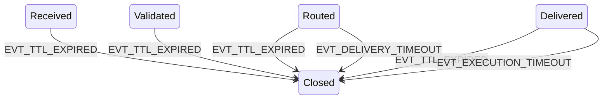
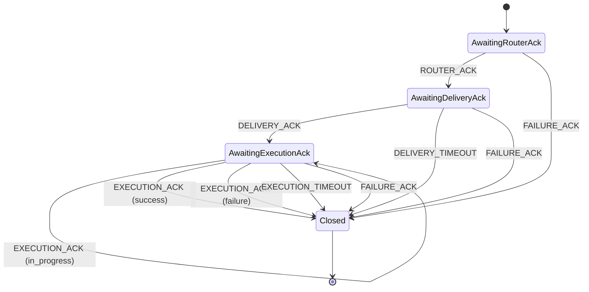

# CMB Transport State Machine --- Formal Specification (v1.0)

Status: Canonical\
Scope: ASP Cognitive Framework --- Transport Layer\
Version: 1.0\
Aligned With: CMB Core Architecture v1.1, ACK Protocol v1.0, Message
Schema Contracts v1.0\
Last Updated: 2026-02-11

------------------------------------------------------------------------

## 1. Purpose

This document defines the deterministic transport state machine
governing message lifecycle within the CMB.

It provides:

-   A formal state set
-   A formal event set
-   Deterministic transition rules
-   Required ACK emissions per transition
-   Timeout and failure transition rules
-   Multi-target aggregation rules
-   Idempotency and ordering constraints

This is a transport-level state machine. It SHALL NOT interpret payload
semantics.

------------------------------------------------------------------------

## 2. Entities and Roles

### 2.1 CMB (Router / Broker)

-   Owns the transport lifecycle for each message transaction
-   Emits ROUTER_ACK and transport FAILURE_ACK
-   Enforces timeouts and TTL
-   Maintains Transaction Records

### 2.2 Target Module Endpoint

-   Receives routed messages
-   Emits DELIVERY_ACK and EXECUTION_ACK
-   MAY emit FAILURE_ACK if it cannot accept or execute

### 2.3 Source Module (Sender)

-   Submits messages to CMB
-   Receives ACKs and reacts at the application layer (outside CMB
    scope)

------------------------------------------------------------------------

## 3. State Set

Canonical lifecycle states:

1.  Created (pre-CMB)\
2.  Received\
3.  Validated\
4.  Routed\
5.  Delivered\
6.  Executed\
7.  Closed

CMB state machine begins at Received.

------------------------------------------------------------------------

## 4. Event Set

Transport events triggering transitions:

-   EVT_RECEIVE_MESSAGE
-   EVT_VALIDATE_OK
-   EVT_VALIDATE_FAIL
-   EVT_ROUTE_OK
-   EVT_ROUTE_FAIL
-   EVT_DELIVERY_ACK
-   EVT_DELIVERY_TIMEOUT
-   EVT_EXECUTION_ACK_SUCCESS
-   EVT_EXECUTION_ACK_FAILURE
-   EVT_EXECUTION_ACK_IN_PROGRESS
-   EVT_EXECUTION_TIMEOUT
-   EVT_TTL_EXPIRED
-   EVT_FORCE_CLOSE (administrative)

------------------------------------------------------------------------

## 5. Transition Table (Single-Target)

Each transition is deterministic. If an event occurs that is not valid
for the current state, it MUST be ignored or logged as an invalid
transition (policy-controlled), and MUST NOT mutate state.

### 5.1 Transition Table

  ---------------------------------------------------------------------------------------------
  Current State  Event                           Next State     Required        Required ACK
                                                                Actions         
  -------------- ------------------------------- -------------- --------------- ---------------
  Received       EVT_VALIDATE_OK                 Validated      create/update   ROUTER_ACK (if
                                                                transaction     not yet sent)
                                                                record; persist 
                                                                transition      

  Received       EVT_VALIDATE_FAIL               Closed         record error;   FAILURE_ACK
                                                                persist error;  
                                                                close           
                                                                transaction     

  Validated      EVT_ROUTE_OK                    Routed         route to        (none)
                                                                target; persist 
                                                                transition      

  Validated      EVT_ROUTE_FAIL                  Closed         record route    FAILURE_ACK
                                                                failure;        
                                                                persist error;  
                                                                close           
                                                                transaction     

  Routed         EVT_DELIVERY_ACK                Delivered      record          DELIVERY_ACK
                                                                delivery;       (forwarded to
                                                                persist ack +   sender per
                                                                transition      policy)

  Routed         EVT_DELIVERY_TIMEOUT            Closed         record timeout; FAILURE_ACK
                                                                persist error;  
                                                                close           
                                                                transaction     

  Delivered      EVT_EXECUTION_ACK_SUCCESS       Executed       record          EXECUTION_ACK
                                                                execution       (forwarded)
                                                                result; persist 
                                                                ack +           
                                                                transition      

  Delivered      EVT_EXECUTION_ACK_FAILURE       Executed       record failure; EXECUTION_ACK
                                                                persist ack +   (forwarded)
                                                                transition      

  Delivered      EVT_EXECUTION_ACK_IN_PROGRESS   Delivered      record status   EXECUTION_ACK
                                                                update; persist (forwarded)
                                                                ack             

  Delivered      EVT_EXECUTION_TIMEOUT           Closed         record timeout; FAILURE_ACK
                                                                persist error;  
                                                                close           
                                                                transaction     

  Any (not       EVT_TTL_EXPIRED                 Closed         record ttl      FAILURE_ACK
  Closed)                                                       expiry; persist 
                                                                error; close    
                                                                transaction     

  Executed       EVT_FORCE_CLOSE                 Closed         finalize;       (optional
                                                                persist close   terminal ack)
                                                                summary         

  Any            EVT_FORCE_CLOSE                 Closed         finalize;       (optional
                                                                persist close   terminal ack)
                                                                summary         
  ---------------------------------------------------------------------------------------------

Notes: - Executed is not automatically Closed; closure policy may
require additional bookkeeping (e.g., sender receipt, final
persistence). Default: close immediately after terminal execution result
and persistence completion. - ROUTER_ACK MUST be emitted exactly once
per message upon successful ingestion. Recommended trigger: after
validation succeeds or after routing begins, depending on your chosen
semantics. Canonical recommendation: emit ROUTER_ACK at
Received→Validated success.

------------------------------------------------------------------------

## 6. Timeout Model

### 6.1 Delivery Timeout

Applies in state: Routed\
If DELIVERY_ACK not received by configured deadline: - Emit FAILURE_ACK
with failure_class = DELIVERY_TIMEOUT - Transition to Closed

### 6.2 Execution Timeout

Applies in state: Delivered\
If EXECUTION_ACK (terminal) not received by configured deadline: - Emit
FAILURE_ACK with failure_class = EXECUTION_TIMEOUT - Transition to
Closed

### 6.3 TTL Expiry

Applies in any non-terminal state. TTL expiry forces closure: - Emit
FAILURE_ACK with failure_class = TTL_EXPIRED - Transition to Closed

All timeouts are policy-driven per channel and/or message priority.

------------------------------------------------------------------------

## 7. Multi-Target State Aggregation

For messages with multiple targets, the CMB maintains per-target
sub-state:

-   target_state\[target\] ∈ {Routed, Delivered, Executed, Closed}
-   per-target delivery/execution timers

### 7.1 Aggregation Rule

The overall transaction state is computed as:

-   Overall = Routed if any target is Routed and none are
    Delivered/Executed? (implementation choice)
-   Overall = Delivered if at least one Delivered and none terminal?
    (implementation choice)
-   Overall = Executed when all required targets have terminal execution
    results (success/failure) OR policy allows partial completion
-   Overall = Closed when terminal closure conditions met per policy

### 7.2 Recommended Canonical Policy (Default)

-   Require delivery for all targets
-   Require terminal execution for all targets
-   Close when all targets terminal OR any target hits non-recoverable
    transport failure (policy may vary)

------------------------------------------------------------------------

## 8. Idempotency and Ordering Constraints

### 8.1 Idempotency

-   Duplicate ACKs MUST NOT create additional transitions
-   Duplicate ACKs MAY be logged for diagnostics

### 8.2 Ordering

-   Delivery ACKs received before routing completion are invalid and
    MUST be rejected/logged
-   Execution ACKs received before Delivery state are invalid and MUST
    be rejected/logged
-   In-progress execution ACKs MAY repeat and do not move state forward

------------------------------------------------------------------------

## 9. Persistence Hooks

At minimum, persistence adapter SHOULD be invoked on:

-   transaction created
-   each state transition
-   each ACK receipt
-   each timeout event
-   terminal closure summary

Persistence is pluggable and must not block the router indefinitely;
consider buffered writes or async persistence adapters (implementation
detail; out of scope for this spec).

------------------------------------------------------------------------

## 10. Failure Classification Mapping

FAILURE_ACK payload SHALL include:

-   failure_class
-   failure_details

Mapping:

-   EVT_VALIDATE_FAIL → VALIDATION_FAILURE
-   EVT_ROUTE_FAIL → ROUTE_FAILURE
-   EVT_DELIVERY_TIMEOUT → DELIVERY_TIMEOUT
-   EVT_EXECUTION_TIMEOUT → EXECUTION_TIMEOUT
-   EVT_TTL_EXPIRED → TTL_EXPIRED
-   otherwise → UNKNOWN_TRANSPORT_ERROR

------------------------------------------------------------------------

## 11. Invariants

1.  Message transactions SHALL NOT transition backwards.
2.  A transaction SHALL reach a terminal state (Closed) exactly once.
3.  ROUTER_ACK SHALL be emitted exactly once per message ingestion
    success.
4.  Per-target DELIVERY_ACK SHALL be recorded at most once per target
    (duplicates ignored).
5.  Per-target terminal EXECUTION_ACK SHALL be recorded at most once per
    target (duplicates ignored).
6.  Timeout events SHALL force transition to Closed unless overridden by
    administrative policy.

------------------------------------------------------------------------
## Appendix A — Transport State Machine (Full View)

```mermaid
%%{init: {"theme":"base"}}%%
stateDiagram-v2
    direction TB

    classDef default stroke:#000000,stroke-width:2px,color:#000000,fill:#ffffff;

    [*] --> Received

    Received --> Validated : EVT_VALIDATE_OK
    Received --> Closed : EVT_VALIDATE_FAIL

    Validated --> Routed : EVT_ROUTE_OK
    Validated --> Closed : EVT_ROUTE_FAIL

    Routed --> Delivered : EVT_DELIVERY_ACK
    Routed --> Closed : EVT_DELIVERY_TIMEOUT

    Delivered --> Executed : EVT_EXECUTION_ACK_SUCCESS
    Delivered --> Executed : EVT_EXECUTION_ACK_FAILURE
    Delivered --> Delivered : EVT_EXECUTION_ACK_IN_PROGRESS
    Delivered --> Closed : EVT_EXECUTION_TIMEOUT

    Executed --> Closed : EVT_FORCE_CLOSE

    Closed --> [*]
```


## Appendix B — Timeout & TTL Transitions


## Appendix — ACK State Machine (Sender View)


